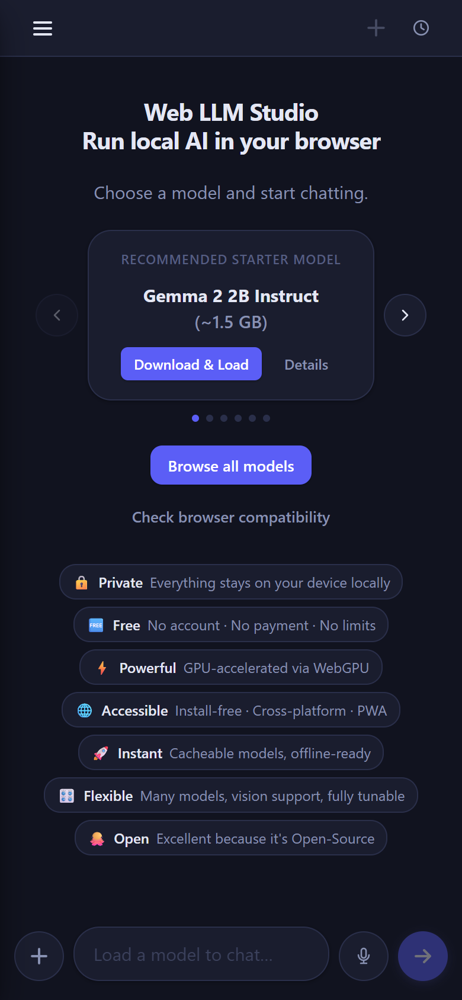
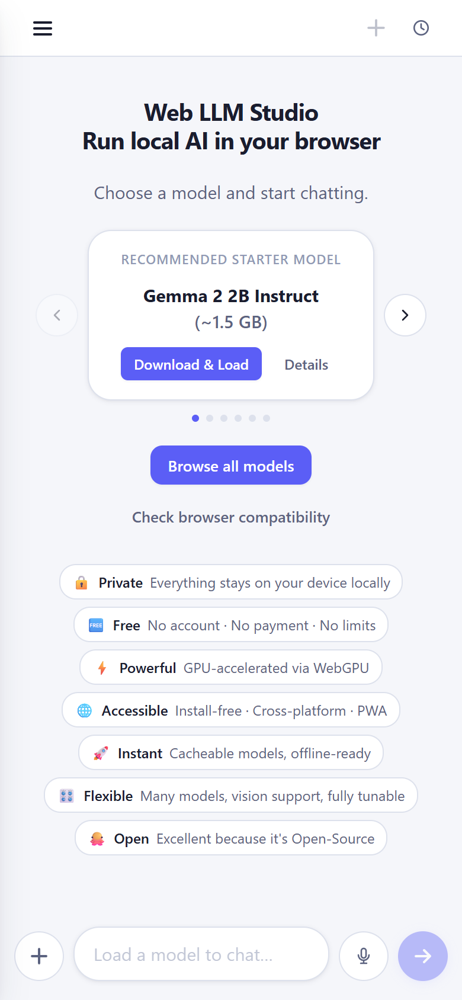
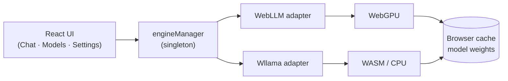

<div align="center">


# Web LLM Studio

**Run real AI models entirely in your browser — no backend, no API keys, no cloud.**

A local LLM playground and model manager that runs entirely in your browser — no installs, no servers.
Browse and download open models once, then chat with them fully offline, accelerated by your own GPU.

[**🔗 Live Demo**](https://emre-bas.github.io/web-llm-studio) · [Features](#features) · [Quick Start](#quick-start) · [Model Catalog](#model-catalog) · [FAQ](#faq)

[](./LICENSE)
[](https://react.dev)
[](https://vite.dev)
[](https://www.typescriptlang.org)
[](https://developer.mozilla.org/docs/Web/API/WebGPU_API)

</div>

---

## Why Web LLM Studio?

Most "AI playgrounds" send your prompts to someone else's servers. Web LLM Studio doesn't —
the model weights, the inference, and your chat history all live on **your** device.

| | | |
|---|---|---|
| 🔒 **Private** | Everything stays on your device. Prompts never leave the browser. |
| 🆓 **Free** | No account · no payment · no usage limits. |
| ⚡ **Powerful** | GPU-accelerated inference via WebGPU. |
| 🌐 **Accessible** | Cross-platform web app — runs in the browser with no install, or [install it as an app (PWA)](#install-as-an-app-pwa). |
| 🚀 **Instant** | Models are cached locally and run offline after the first download. |
| 🎛️ **Flexible** | Hundreds of models, vision support, fully tunable generation. |
| 🐙 **Open** | 100% open-source. Fork it, host it, extend it. |

---

## Screenshots

<p align="center">
  
  &nbsp;&nbsp;
  
</p>

<p align="center"><sub>Welcome screen — dark &amp; light themes (mobile).</sub></p>

---

## Features

- **Zero-backend architecture** — the entire app is a static site; there is no server to run.
- **WebGPU inference** via [`@mlc-ai/web-llm`](https://github.com/mlc-ai/web-llm) for fast, GPU-accelerated chat.
- **CPU / GGUF inference** via [`@wllama/wllama`](https://github.com/ngxson/wllama) (experimental) for devices without WebGPU.
- **Live model catalog** — the WebLLM model list is fetched at runtime from a CDN, so the app keeps showing current models long after it was built (see [Model Catalog](#model-catalog)).
- **Filterable model browser** — search and filter by engine, format, quantization, parameter size, and RAM.
- **Chat-first interface** — streaming responses, starter-prompt suggestions, and a clean composer.
- **Rich Markdown rendering** — assistant replies render Markdown with GitHub-flavored tables, lists, and syntax-highlighted code blocks (each with a one-click copy button).
- **Vision support** 👁️ — load a vision model (e.g. Phi-3.5 Vision) and attach images to ask about them.
- **File & PDF attachments** — drop in text, code, or PDF files and reference their contents in chat.
- **Voice** 🔊🎤 — read replies aloud (text-to-speech) and dictate messages with the microphone (speech-to-text), via the browser's built-in speech services.
- **Edit & regenerate** — revise a sent message or re-run any reply to get a fresh answer.
- **Saved chat history** — conversations are stored locally and grouped by date; resume them anytime.
- **Import / export conversations** — back up or share chats as a portable, versioned JSON file.
- **Tunable generation** — per-conversation system prompt, temperature, max tokens, plus advanced sampling (top-p, top-k, seed, stop sequences, repetition penalties), with global defaults for new chats.
- **Context meter & live stats** — see context-window usage and tokens-per-second while generating.
- **Switch models mid-chat** — change the loaded model and keep the same conversation with full context.
- **Guided first download** — a pre-download dialog sets expectations (size, one-time, offline-after), with a download ETA, a WebGPU pre-check, and friendly error recovery.
- **Model cache management** — inspect, verify, and delete cached model weights.
- **Storage dashboard** — view browser storage quota and request persistent storage.
- **System status page** — check WebGPU availability, GPU adapter, and a model-size guide for your device.
- **Responsive & mobile-friendly** — off-canvas navigation drawer and touch-friendly layout.
- **Installable (PWA)** — optionally add it to your home screen or desktop and launch it in its own standalone window; works offline after the first load.
- **Dark mode** — theming via CSS custom properties.
- **One-click deploy** — ships with a GitHub Pages deployment workflow.

---

## How it compares

| | **Web LLM Studio** | LM Studio / Ollama | Hosted (ChatGPT, etc.) |
|---|:---:|:---:|:---:|
| No install *required* — runs in the browser | ✅ (installable as a PWA) | ❌ Desktop app | ✅ |
| Runs on your own hardware | ✅ | ✅ | ❌ Cloud |
| Local AI on phones, tablets & Chromebooks | ✅ | ❌ Desktop only | ❌ Cloud |
| Prompts stay private (local) | ✅ | ✅ | ❌ Sent to server |
| No account or payment | ✅ | ✅ | ❌ Usually required |
| Beginner-friendly — No technical barrier | ✅ | ❌ Install / CLI | ✅ |
| GPU acceleration | ✅ WebGPU | ✅ Native | ✅ Cloud |
| Works offline | ✅ After download | ✅ After download | ❌ |
| Handles very large models (>~4 GB) | ⚠️ Browser memory limits | ✅ | ✅ |

**Where it shines:** zero-friction, private, in-browser AI on any device.
**Where to reach for a desktop tool:** very large models or sustained heavy GGUF workloads.

---

## Quick Start

**Prerequisites:** Node.js 18+

```bash
git clone https://github.com/emre-bas/web-llm-studio
cd web-llm-studio
npm install
npm run dev
```

Open [http://localhost:5173](http://localhost:5173), pick a recommended starter model
(e.g. **Gemma 2 2B** or the tiny **SmolLM2 360M**), let it download once, and start chatting.

> 💡 First load downloads the model weights (a few hundred MB to a few GB depending on the model).
> After that, the model is cached and loads instantly — even offline.

### Which model should I pick?

| Your device | Suggested model | Download | Notes |
|---|---|---|---|
| Low-end / no dedicated GPU | **SmolLM2 360M** | ~230 MB | Tiny, fast — great for a first test |
| Most laptops | **Gemma 2 2B** | ~1.5 GB | Balanced quality, the default starter |
| Strong GPU (4 GB+ VRAM) | **Llama 3.2 3B** | ~2 GB | Higher quality, slower to load |
| Want image understanding | **Phi-3.5 Vision** | ~3.5 GB | Attach photos in chat (needs a capable GPU) |

Not sure what your hardware can handle? The in-app **System Status** page recommends sizes for your device.

---

## Tech Stack

| Layer | Choice |
|---|---|
| Build | Vite 7 |
| UI | React 19 + TypeScript 5.9 |
| State | Zustand |
| Router | React Router v7 (hash mode) |
| Styling | CSS Modules + CSS custom properties |
| WebGPU LLM | `@mlc-ai/web-llm` |
| GGUF LLM | `@wllama/wllama` |
| Deploy | GitHub Pages via Actions |

### How it's wired

- **Hash routing** (`/#/models`, `/#/dashboard`) so it works on any static host with no server-side routing.
- **Engine adapters** (`src/engines/`) abstract WebLLM and Wllama behind a common interface, coordinated by an `engineManager` singleton — the UI only talks to the manager.
- **Lazy-loaded engines** — both inference libraries are dynamically imported, so their large bundles (≈6 MB WebGPU, ≈2.8 MB WASM) are only fetched when you actually load a model.
- **Persisted settings only** — Zustand persists user settings; runtime engine state is kept in memory.



---

## Supported Engines

### WebLLM (recommended)

[WebLLM](https://github.com/mlc-ai/web-llm) compiles models to WebGPU using the MLC framework,
delivering near-native GPU inference speeds in the browser.

**Requirements:** Chrome 113+, Edge 113+, or any WebGPU-enabled browser.

**Models:** Hundreds, including SmolLM2, Qwen2.5, Llama 3.2, Gemma 2, Phi-3.5 (incl. Vision), and TinyLlama — see [Model Catalog](#model-catalog).

### Wllama (experimental — GGUF)

[Wllama](https://github.com/ngxson/wllama) runs GGUF model files via WebAssembly (llama.cpp compiled to WASM). CPU-only and considerably slower than WebLLM.

**Limitations:**
- CPU-bound — slower than native by ~5–20×.
- Browser memory limits (~2–4 GB per tab).
- Files over 2 GB may fail in some browsers.
- For heavy GGUF usage, prefer [LM Studio](https://lmstudio.ai) or [Ollama](https://ollama.ai) locally.

---

## Model Catalog

The app combines two sources so it stays both **fast** and **current**:

1. **Bundled catalog** — curated JSON files in `public/catalogs/` (`webllm.json`, `gguf.json`) ship with the build and render instantly, with hand-written names, descriptions, and recommendations.
2. **Live catalog** — on startup the app fetches the full WebLLM model list from a CDN and merges it in, overlaying the curated metadata. This means a build deployed today will still surface models that WebLLM adds **years later**, with no rebuild required.

> ⚙️ The model *list* is live, but the WebLLM *runtime engine* is pinned to the bundled version,
> so a brand-new model that needs a newer engine than the build ships with may not load.

Fallback chain (never breaks): cached → CDN → bundled JSON → built-in fallback list.

### Schema

```json
{
  "id": "unique-model-id",
  "name": "Model Display Name",
  "provider": "Provider Name",
  "engine": "webllm",
  "format": "mlc",
  "repo": "org/repo",
  "modelId": "WebLLM-Model-ID",
  "sizeLabel": "~500 MB",
  "estimatedRam": 700,
  "estimatedVram": 700,
  "quantization": "q4f16",
  "parameterSize": "1B",
  "architecture": "LlamaForCausalLM",
  "tags": ["instruct"],
  "recommended": true,
  "experimental": false,
  "disabled": false,
  "description": "Short description.",
  "warnings": [],
  "license": "Apache-2.0",
  "sourceUrl": "https://huggingface.co/...",
  "supportsVision": false
}
```

### Adding models

1. **WebLLM:** find the `model_id` in [WebLLM's config](https://github.com/mlc-ai/web-llm/blob/main/src/config.ts) and add an entry to `public/catalogs/webllm.json`. Set `"supportsVision": true` for multimodal models.
2. **GGUF:** find the HuggingFace repo and `.gguf` file, then add it to `public/catalogs/gguf.json` with `"engine": "wllama"` and a `file` field.
3. Mark new entries `"experimental": true` until verified.

---

## Build & Deploy

```bash
npm run build     # type-check + production build to dist/
npm run preview   # preview the production build locally
npm run lint      # run ESLint
npm test          # run the unit tests (Vitest)
```

### GitHub Pages

Deployment runs via **GitHub Actions** and is **release-gated** — the live site updates only when you publish a release, not on every push. `main` stays the integration branch.

1. Push the repo to GitHub.
2. Go to **Settings → Pages → Source → GitHub Actions**.
3. Every push and pull request runs [CI](.github/workflows/ci.yml) — lint, tests, and a build.
4. To publish a release: bump the version and push the tag, then publish a GitHub Release for it:
   ```bash
   npm version minor          # or patch / major — commits + creates a vX.Y.Z tag
   git push --follow-tags
   ```
   Publishing the GitHub Release for that tag triggers [`deploy.yml`](.github/workflows/deploy.yml), which builds and deploys to Pages. (You can also deploy on demand from the **Actions** tab via *Run workflow*.)

The production build uses **relative asset paths** and **hash routing**, so `dist/` can be dropped onto any static host (GitHub Pages, Netlify, Cloudflare Pages, S3, …) without extra configuration.

---

## Browser Requirements

| Feature | Minimum |
|---|---|
| App shell | Any modern browser |
| WebLLM (WebGPU) | Chrome 113+, Edge 113+ |
| Wllama (GGUF) | Any browser with WASM + SharedArrayBuffer |
| Persistent storage | Chrome, Firefox, Edge |

Not sure if your device qualifies? The in-app **System Status** page reports WebGPU availability,
your GPU adapter, and a model-size guide tailored to your hardware.

---

## Offline & Cache Behavior

- The app shell (HTML/JS/CSS) can be cached for offline use.
- Model weights are downloaded on first use; later loads come from the browser cache.
- Request **Persistent Storage** in the app to prevent the browser from evicting cached weights.
- Cache can be inspected and cleared from the Models page (or browser DevTools).

---

## Install as an app (PWA)

Web LLM Studio is a **Progressive Web App**. You don't *have* to install it — it runs
fine in a normal browser tab — but you can install it as a standalone app if you prefer
an app-like experience:

| Platform | How to install |
|---|---|
| **Desktop (Chrome / Edge)** | Click the install icon in the address bar, or **⋮ → Install Web LLM Studio**. |
| **Android (Chrome)** | **⋮ → Add to Home screen** / **Install app**. |
| **iOS / iPadOS (Safari)** | **Share → Add to Home Screen**. |

Once installed, it launches in its own window (no browser chrome), keeps your cached
models and chat history, and works offline after the first download — exactly like the
in-browser version. The app ships a web manifest and a service worker (via
[`vite-plugin-pwa`](https://vite-pwa-org.netlify.app)) and updates itself automatically
when a new version is deployed.

---

## Privacy

- **No API key required** — all inference runs locally.
- **Prompts processed locally** — nothing is sent to any server by default.
- **Chat history is local** — conversations are saved only in your browser's storage.
- **Model downloads** contact HuggingFace / the MLC CDN to fetch weights, and the model *list* is fetched from a public CDN.
- **No telemetry** — no analytics, tracking, or reporting of any kind.

> **Model license notice:** model weights carry their own licenses, independent of this app's MIT license. Check each model's license before redistribution or commercial use.

---

## Known Limitations

1. **Memory:** browsers typically allow 2–4 GB per tab; large models may crash.
2. **WebGPU coverage:** not universal — Chrome/Edge are the most reliable.
3. **GGUF speed:** CPU inference is much slower than native tools.
4. **Engine version:** the model list is live, but the bundled engine is fixed at build time (see [Model Catalog](#model-catalog)).
5. **Cache eviction:** without persistent storage, the browser may clear cached weights.

---

## FAQ

**Is it really free?**
Yes. There's no account, no payment, and no usage limits. The only "cost" is the one-time model download and your device's compute.

**Where do the models download from?**
Model weights come from the HuggingFace / MLC CDN, and the WebLLM model *list* is fetched from a public CDN at runtime. Nothing else leaves your browser.

**Does it work offline?**
Yes — once a model is downloaded and cached, you can chat with it without a connection. Request **Persistent Storage** in the app so the browser doesn't evict the cache.

**Why is my model slow (or failing to load)?**
You're likely on CPU/WASM (no WebGPU) or low on memory. Try a smaller model, use Chrome/Edge, and check the **System Status** page for your WebGPU status.

**Where are my conversations stored?**
Locally, in your browser's `localStorage`. They never sync anywhere, and clearing browser data removes them.

**Can I add my own models?**
Yes — see [Adding models](#adding-models).

---

## Acknowledgements

- [WebLLM](https://github.com/mlc-ai/web-llm) & the [MLC](https://mlc.ai) project — WebGPU inference.
- [Wllama](https://github.com/ngxson/wllama) — GGUF / llama.cpp in WebAssembly.
- [LM Studio](https://lmstudio.ai) — inspiration for the model-management experience.

---

## Contributing

Contributions are welcome! See [CONTRIBUTING.md](CONTRIBUTING.md) for the full
guide and [CODE_OF_CONDUCT.md](CODE_OF_CONDUCT.md). In short:

1. Fork the repo and create a `feat/…` or `fix/…` branch.
2. Make your changes.
3. Run `npm run lint && npm test && npm run build`.
4. Open a pull request against `main`.

The easiest first contribution is **adding model entries** to the JSON catalogs in `public/catalogs/` — see [Adding models](#adding-models).

---

## License

[MIT License](./LICENSE)

<div align="center">

Built with ❤️ for local, private, in-browser AI.

</div>
